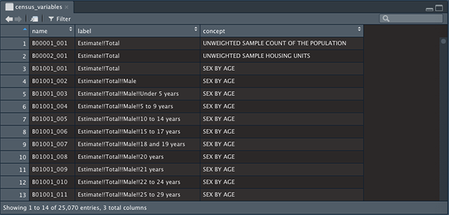
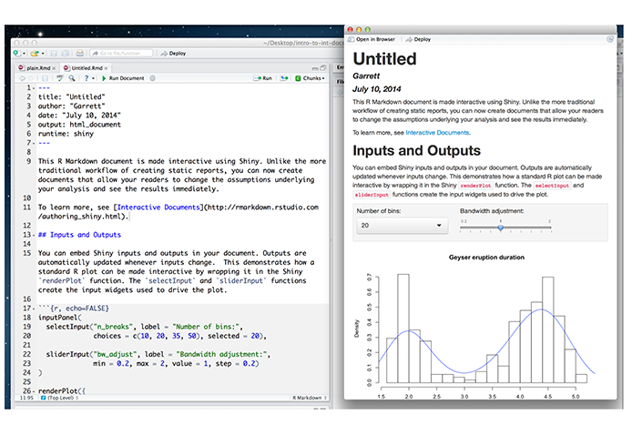
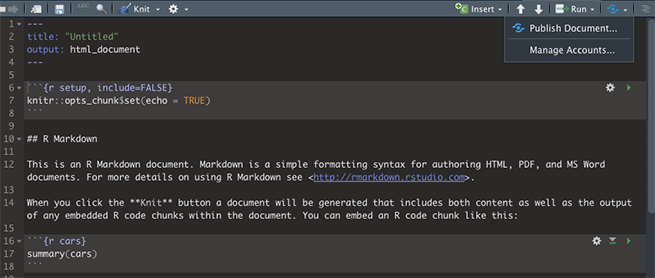

#  Learning Objectives
##  - To map points with the Leaflet for R package.
##  - To download a polygon using the tidycensus package.
##  - To map polygons with the Leaflet for R package.
##  - To have basic familiarity with R Markdown.
##  - To embed your map in R Markdown and share it using RPubs.
---
class: inverse, center, middle

# Getting Started

---
# Open up R-Studio
--

## For an RScript: `File -> New File -> RScript`

--

## For a R Markdown document: `File -> New File -> R Markdown`

--
## You don't have to change anything in the **New Markdown Document** options window.. Just click OK and we'll change some things later!

--


---

# Installing Packages

Install and load these packages before we start!

```{r eval=FALSE, tidy=FALSE}
install.packages("leaflet")
install.packages("tidycensus")
install.packages("tidyverse")
install.packages("rgdal")
install.packages("sf")
install.packages("rmarkdown")
install.packages("magrittr")

library(leaflet)
library(tidycensus)
library(tidyverse)
library(rgdal)
library(sf)
library(rmarkdown)
library(magrittr)
```


---
# Important thing to note!

## Make sure to not use absolute paths!!!

--

## Example:

--

## `C:/Users/DataServices/Workshop/`
##`Making_Web_Maps_With_R`
## `/Data/shapefile.shp`

--

## Use relative paths instead.

--

## Example:

--

## `./Data/shapefile.shp`

--


---

.scroll-output[
# Mapping points with the Leaflet for R Package

```{r, include = FALSE}
library(rgdal)
library(leaflet)
```


```{r eval = FALSE}
ltc_facilities <- readOGR("./dataprep/SLC_LTC_Facilities/slc_ltc_facilities.shp", verbose = FALSE)
leaflet() %>%
  addTiles() %>%
  addMarkers(data = ltc_facilities, lng = ~LONGITUDE, lat = ~LATITUDE, 
           popup =  as.character(ltc_facilities$FACILITY),  
           label = as.character(ltc_facilities$FACILITY))   

```


```{r eval = TRUE, echo = FALSE}
ltc_facilities <- readOGR("./dataprep/SLC_LTC_Facilities/slc_ltc_facilities.shp", verbose = FALSE)
leaflet() %>%
  addTiles() %>%
  addMarkers(data = ltc_facilities, lng = ~LONGITUDE, lat = ~LATITUDE, popup = as.character(ltc_facilities$FACILITY),
           label = as.character(ltc_facilities$FACILITY))

```
]

---

# Another Important thing to note!

## Make sure to set `verbose = FALSE` to suppress any warning messages. This doesn't fix everything though, for we will have to change another option later on.

---
# Downloding a Polygon with the tidycensus package
```{r eval = FALSE}
census_api_key("ENTER API KEY HERE")
census_variables <- load_variables(2017, "acs5", cache = TRUE)

```

.center[]


---
# Downloading a Polygon with the tidycensus package
## Here are the variables we are interested in...

```{r, eval = TRUE, echo = FALSE}
library(DT)

df <- data.frame("name" = c("B18101_00", "B18101_016", "B18101_019", "B18101_035", "B18101_038"),
                              "label" = c("Total Population", "Estimate- Total Male 65 to 74 years old with a
                              disability", "Estimate - Totale Male 75 years and older with a disability",
                              "Estimate - Total Female 65 to 74 years with a disability", "Estimate - Total
                              Female 75 years and over with a disability"),
                              "concept" = c("Sex and Age by Disability Status", "Sex and Age by Disability  
                              Status", "Sex and Age by Disability Status", "Sex and Age by Disability Status",
                              "Sex and Age by Disability Status"))

datatable(df, options = list(dom = 't')) 

```
---

# Downloading a Polygon with the tidycensus package
```{r, include = FALSE}
library(tidycensus)
census_api_key("e758b8cf88c937a42cd051ff1ecfb2bb0d1fec41")

```


```{r, eval = FALSE}

stlouis_disabled <- get_acs(geography = "tract", 
                   variables = c("B18101_001", "B18101_016", "B18101_019",
                                 "B18101_035", "B18101_038"), state = "MO", 
                            county = "510", geometry = TRUE, output = "wide")
```

---
# Downloading a Polygon with the tidycensus package
## Creating a new variable with the mutate function
```{r, eval = FALSE}
stlouis_disabled <- get_acs(geography = "tract", 
                   variables = c("B18101_001", "B18101_016", "B18101_019",
                                 "B18101_035", "B18101_038"), state = "MO", 
                            county = "510", geometry = TRUE, output = "wide") %>%
  mutate(totalpop = B18101_016E + B18101_019E+ B18101_035E  + B18101_038E, #<<
          percent_disb = (totalpop/B18101_001E)*100) #<<
```
 The pipe operation above (`%>%`) moves the variables from the previous operation to the next 
operation which is to sum up all of the total populations by sex.
---
.scroll-output[
# Mapping points with the Leaflet for R Package

class: center

```{r, include = FALSE}
library(rgdal)
library(leaflet)
library(tidycensus)
library(tidyverse)

census_api_key("e758b8cf88c937a42cd051ff1ecfb2bb0d1fec41")

ltc_facilities <- readOGR("./dataprep/SLC_LTC_Facilities/slc_ltc_facilities.shp", verbose = FALSE)
stlouis_disabled <- get_acs(geography = "tract", 
                   variables = c("B18101_001", "B18101_016", "B18101_019",
                                 "B18101_035", "B18101_038"), state = "MO", 
                            county = "510", geometry = TRUE, output = "wide") %>%
  mutate(totalpop = B18101_016E + B18101_019E+ B18101_035E + B18101_038E,
          percent_disb = (totalpop/B18101_001E)*100)


```


```{r eval = FALSE}
#setting the color palette for the polygon
pal = colorNumeric(palette = "viridis", domain = stlouis_disabled$percent_disb) #<<

map <- leaflet() %>%
  addTiles() %>%
  addMarkers(data = ltc_facilities, lng = ~LONGITUDE, lat = ~LATITUDE, label = ltc_facilities$FACILITY) %>% 
  addPolygons(data = stlouis_disabled, fillOpacity = 0.4, stroke = FALSE, color = ~pal(percent_disb)) #<<
map
```

```{r eval = TRUE, message = FALSE, warning = FALSE, echo = FALSE}
#setting the color palette for the polygon
pal = colorNumeric(palette = "viridis", domain = stlouis_disabled$percent_disb)

map <- leaflet() %>%
  addTiles() %>%
  addMarkers(data = ltc_facilities, lng = ~LONGITUDE, lat = ~LATITUDE, label = ltc_facilities$FACILITY) %>%
  addPolygons(data = stlouis_disabled, fillOpacity = 0.4, stroke = FALSE, color = ~pal(percent_disb)) 
map
```
]


---
.scroll-output[
# Adding a legend to your leaflet map
```{r  eval = FALSE}

map <- leaflet() %>%
  addTiles() %>%
  addMarkers(data = ltc_facilities, lng = ~LONGITUDE, lat = ~LATITUDE, label = ltc_facilities$FACILITY) %>%
  addPolygons(data = stlouis_disabled, fillOpacity = 0.4, stroke = FALSE, color = ~pal(percent_disb),
              popup = stlouis_disabled$NAME) %>%
  addLegend(data = stlouis_disabled, pal = pal,  values = ~stlouis_disabled$percent_disb, opacity = 1, #<<
            position = "bottomright", title = "Disabled Population",  #<<
            labFormat = labelFormat(suffix = "%")) #<<
map
```

```{r  eval = TRUE, echo = FALSE, message = FALSE, warning = FALSE}

map <- leaflet() %>%
  addTiles() %>%
  addMarkers(data = ltc_facilities, lng = ~LONGITUDE, lat = ~LATITUDE, label = ltc_facilities$FACILITY) %>%
  addPolygons(data = stlouis_disabled, fillOpacity = 0.4, stroke = FALSE, color = ~pal(percent_disb),
              popup = stlouis_disabled$NAME) %>%
  addLegend(data = stlouis_disabled, pal = pal,  values = ~stlouis_disabled$percent_disb, opacity = 1,
            position = "bottomright", title = "Disabled Population", 
            labFormat = labelFormat(suffix = "%"))
map
```
]

---
.scroll-output[
# Adding interactivity to the map
```{r  eval = FALSE}
map <- leaflet() %>%
  addTiles() %>%
  addMarkers(data = ltc_facilities, lng = ~LONGITUDE, lat = ~LATITUDE, label = ltc_facilities$FACILITY,
             group = "Long Term Care Facilities") %>% #<<
  addPolygons(data = stlouis_disabled, fillOpacity = 0.4, stroke = FALSE, color = ~pal(percent_disb),
              group = "Percentage of Population", popup = stlouis_disabled$NAME) %>% #<<
  addLegend(data = stlouis_disabled, pal = pal,  values = ~stlouis_disabled$percent_disb, opacity = 1,
            position = "bottomright", title = "Disabled Population", 
            labFormat = labelFormat(suffix = "%")) %>%
  #We will add the layer control here
  addLayersControl(
    overlayGroups = c("Long Term Care Facilities", "Percentage of Population"), #<<
    options = layersControlOptions(collapsed = FALSE)) #<<

map
```

```{r  eval = TRUE, echo = FALSE, message = FALSE, warning = FALSE}
map <- leaflet() %>%
  addTiles() %>%
  addMarkers(data = ltc_facilities, lng = ~LONGITUDE, lat = ~LATITUDE, label = ltc_facilities$FACILITY,
             group = "Long Term Care Facilities") %>%
  addPolygons(data = stlouis_disabled, fillOpacity = 0.4, stroke = FALSE, color = ~pal(percent_disb),
              group = "Percentage of Population", popup = stlouis_disabled$NAME) %>%
  addLegend(data = stlouis_disabled, pal = pal,  values = ~stlouis_disabled$percent_disb, opacity = 1,
            position = "bottomright", title = "Disabled Population", 
            labFormat = labelFormat(suffix = "%")) %>%
  #We will add the layer control here
  addLayersControl(
    overlayGroups = c("Long Term Care Facilities", "Percentage of Population"),
    options = layersControlOptions(collapsed = FALSE))

map
```
]
---
# Introduction to R Markdown

.center[]


---
# Header 1 `# Header 1`
## Header 2 `## Header 2`
### header 3 `### Header 3`
--
<br>
</br>
<br>
</br>
### *This is italicized* `*This is italicized*`

### **This is bold** `**This is bold**`

---
# Inserting R Code Chunks

## **Insert -> R **

## For today's workshop, we will create two code chunks.

--
### Pre-processing code chunk

--

### Mapping code chunk

---

# Code chunk options

## include = TRUE/FALSE
### Prevents the code and results from appearing from the finished file. Other code chunks can use it though.
--

## echo = TRUE/FALSE
### Whether to display the code along with its results

--

## message = TRUE/FALSE
### Whether to display messages.

--

## warning = TRUE/FALSE
### Whether to display warning messages.


---

# Code chunk options

## The preprocessing code chunk will have the option of **include = FALSE** 
### - Loading packages
### - Loading the points shapefile
### - Downloading the polygon shapefile
### - Setting the color palette for the polygon

---

# Code chunk options

## The second code chunk will have the options of **eval = TRUE, echo = FALSE, message = FALSE, warning = FALSE**
### - Mapping of points and polygons
### - Adding a legend
### - Adding a layer control panel

---

# Final touches!

--

## - Adding a title and author above your code chunks

--
## - Adding a brief description of your map

--

## - Preview your map by clicking the **Knit** button

---

# Uploading your map online

## - Go to the [R Pubs](http://www.rpubs.com/) website and register for an account.

--

## - Publish your document from R Studio

.center[]


---

# Now it's time to make your own leaflet map!


